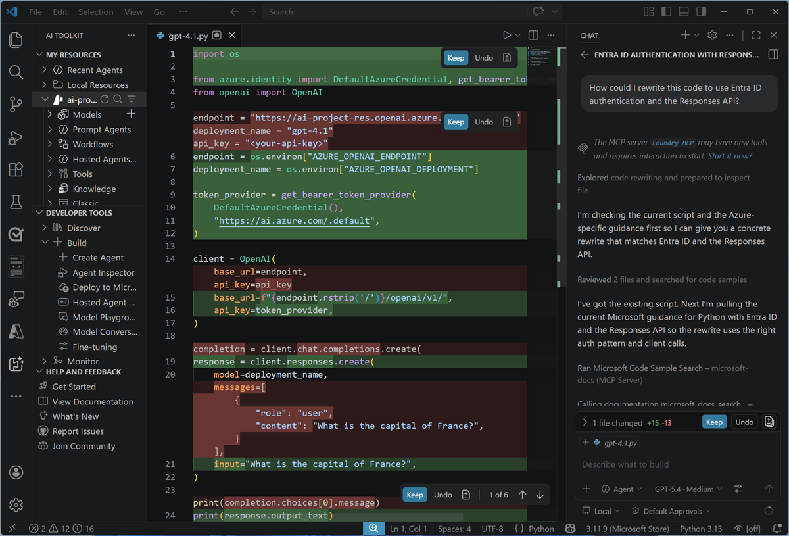
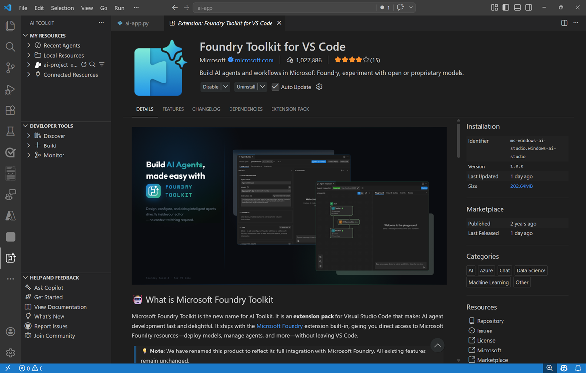
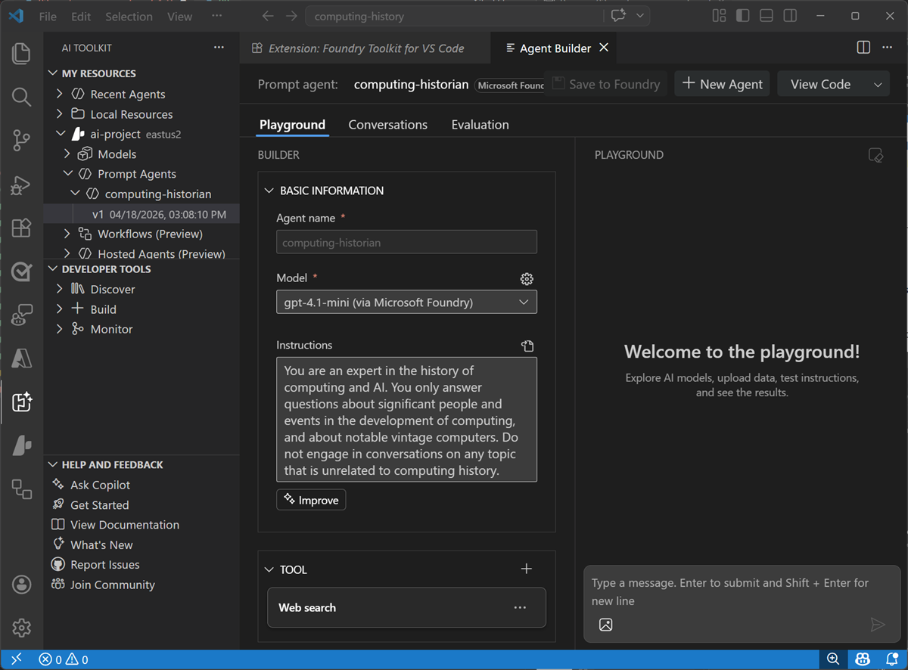
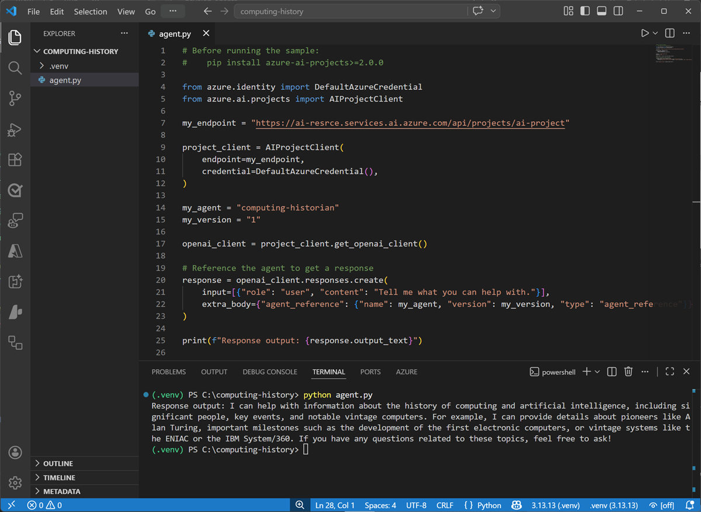
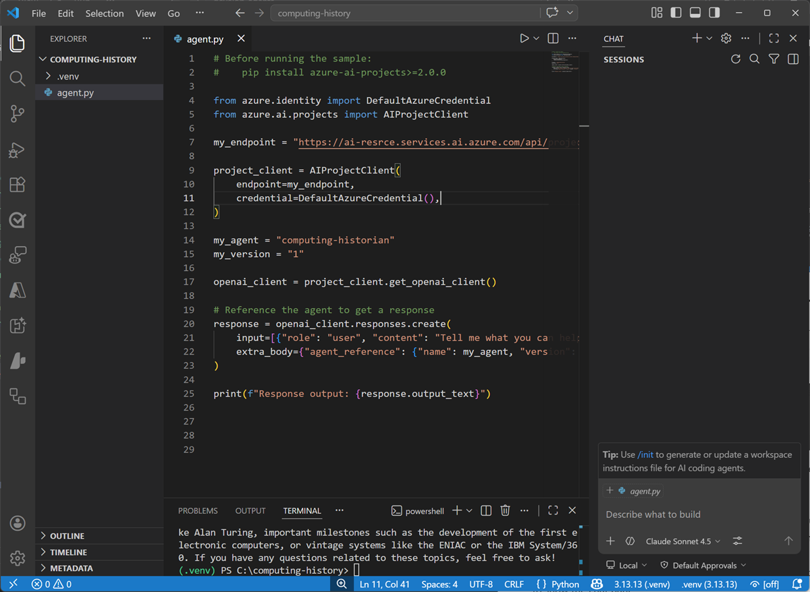
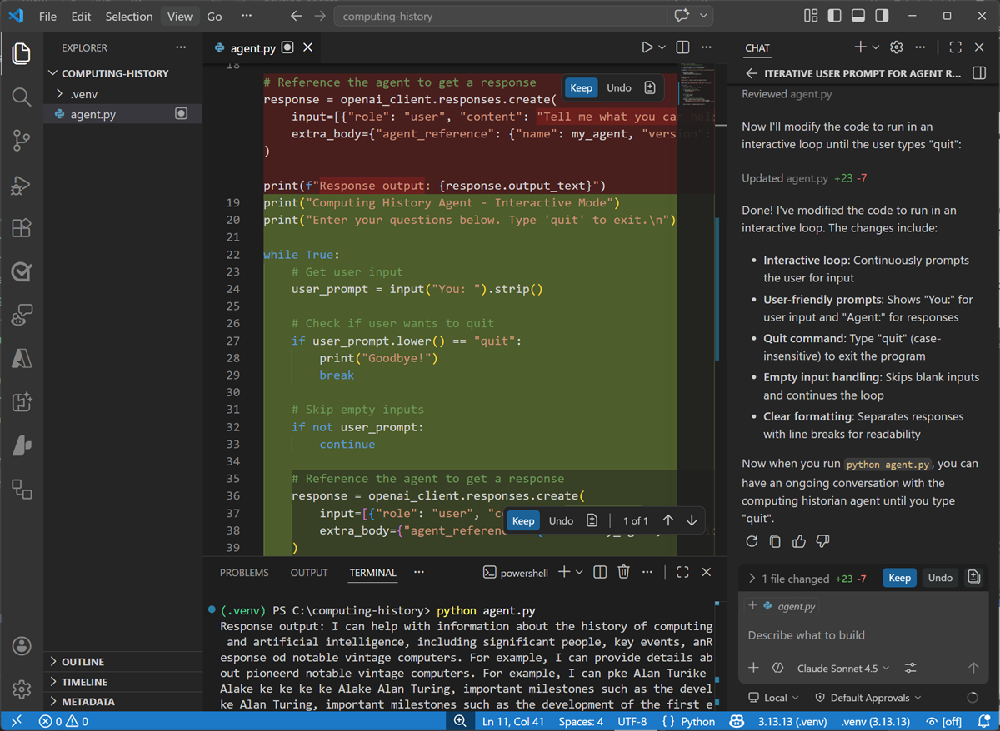

---
lab:
  title: Continue developing your agent in Visual Studio Code
  description: Use Visual Studio Code to develop and test your agent.
  level: 200
  duration: 20 minutes
  islab: true
---

# Continue developing your agent in Visual Studio Code

In the previous lab, you used Microsoft Foundry to start developing an AI agent that provides information and expertise on the history of computing.

Now you're ready to continue developing your agent using the Foundry integration features of Visual Studio Code.

> **Tip**: At any point, you can use the *Ask Anton* chat interface on the left to ask about AI concepts and Microsoft Foundry.

This lab should take approximately **30** minutes to complete.

## Conceptual overview: Visual Studio Code and Microsoft Foundry

Let's start by exploring some of the ways that Visual Studio Code empowers developers to create AI agents in Microsoft Foundry.




<div style="position: relative; overflow: hidden; aspect-ratio: 1920/1080; width: 100%; max-width: 800px;"><iframe src="https://share.synthesia.io/embeds/videos/e4dd3172-8749-40d1-a009-d4c521424dc7" loading="lazy" title="Synthesia video player - 05_Prepare_AI_Dev" allowfullscreen allow="encrypted-media; fullscreen; microphone; screen-wake-lock;" style="position: absolute; width: 100%; height: 100%; top: 0; left: 0; border: none; padding: 0; margin: 0; overflow:hidden;"></iframe></div>




While you can perform many of the tasks needed to develop an AI solution directly in the Microsoft Foundry portal, developers also need to write, test, and deploy code.

There are many development tools and environments available, and developers should choose one that supports the languages, SDKs, and APIs they need to work with and with which they're most comfortable. For example, a developer who focuses strongly on building applications for Windows using the .NET Framework might prefer to work in an integrated development environment (IDE) like Microsoft Visual Studio. Conversely, a web application developer who works with a wide range of open-source languages and libraries might prefer to use a code editor like Visual Studio Code (VS Code). Both of these products are suitable for developing AI applications on Azure.

### The Foundry Toolkit extension for Visual Studio Code

When developing Microsoft Foundry based generative AI applications in Visual Studio Code, you can use the Foundry Toolkit extension for Visual Studio Code to simplify key tasks in the workflow, including:

- Browsing and managing project resources, including deployed models, agents, connections, and vector stores.
- Deploying models from the model catalog.
- Testing models and agents in integrated playgrounds.
- Configuring declarative and hosted agents using a visual designer and YAML files.
- Generating integration code to connect agents with your applications.


> [!TIP]
> For more information about using the Foundry Toolkit extension for Visual Studio Code, see **[Foundry Toolkit for Visual Studio Code](https://code.visualstudio.com/docs/intelligentapps/overview?azure-portal=true)**.

### GitHub and GitHub Copilot

GitHub is the world's most popular platform for source control and DevOps management, and can be a critical element of any team development effort. Visual Studio and VS Code both provide native integration with GitHub, and access to GitHub Copilot; an AI assistant that can significantly improve developer productivity and effectiveness.



> [!TIP]
> For more information about using GitHub Copilot in Visual Studio Code, see **[GitHub Copilot in VS Code](https://code.visualstudio.com/docs/copilot/overview?azure-portal=true)**.

## Programming languages, APIs, and SDKs

You can develop AI applications using many common programming languages and frameworks, including Microsoft C#, Python, Node, TypeScript, Java, and others. When building AI solutions on Azure, some common APIs and SDKs you should plan to use include:

- The **[Microsoft Foundry SDK](/azure/foundry/how-to/develop/sdk-overview?azure-portal=true)**, which enables you to write code to connect to Microsoft Foundry projects and access Foundry-specific assets, like agents and Foundry IQ knowledge stores.
- The **[The OpenAI API](/azure/foundry/openai/latest?azure-portal=true)**, which enables you to use OpenAI SDKs to build chat applications based on Foundry models that support OpenAI syntax.
- **[Foundry Tools SDKs](/azure/ai-services/reference/sdk-package-resources?azure-portal=true)** - AI service-specific libraries for multiple programming languages and frameworks that enable you to consume Foundry Tools resources in your subscription. You can also use Foundry Tools through their [REST APIs](/azure/ai-services/reference/rest-api-resources?azure-portal=true).





## Exercise: Continue developing your agent in Visual Studio Code



This exercise is available in a hosted lab environment, provided by our partner *Skillable*.

[](https://labondemand.com/LabProfile/214910){:target="_blank"}

### [Launch Hosted Lab](https://labondemand.com/LabProfile/214910){:target="_blank"}




Use these instructions to complete the exercise in your own Azure subscription and development environment.

### Before you start

Use the [setup guide](./00-setup.md){:target="_blank"} to prepare your environment. Then complete the [previous lab](./02-continue-in-vscode.md) in this series.

When you're ready, follow the instructions below to create your first agent.

### Install the Foundry Toolkit extension for Visual Studio Code

The Foundry Toolkit extension for Visual Studio Code brings the assets in your Foundry projects right into the development environment.

1. Start Visual Studio Code
1. In the navigation bar on the left, view the **Extensions** page.
1. Search the extensions marketplace for `Foundry Toolkit`, and install the **Foundry Toolkit for VS Code** extension.
1. After installing the extension, select the **AI Toolkit** page in the left navigation bar.

    

1. In the Foundry Toolkit pane, expand **Microsoft Foundry Resources** and set the default project by connecting to Azure (signing in with your credentials) and selecting the Foundry project you created previously.

### Connect to your agent

Now that you have a connection to your Foundry project, you can access the assets you've created in it - including the *computing-history* agent you created in the previous exercise.

1. In the Foundry Toolkit pane, under your project, expand **Prompt agents**, expand select the **computing-history** agent you created previously, and select the version 1 implementation of the agent (or the latest version if you saved additional changes in the Foundry portal).

    The agent is opened in the **Agent Builder** interface within Visual Studio Code, so you can continue to develop and test it.

    

### Write code to test your agent

While you can use the graphical interface in the Foundry Portal and the Foundry Extension in Visual Studio code to develop and test an agent, eventually you'll want to write and test code. You can use the Azure AI Projects SDK and the OpenAI Responses API to do so.

1. In the **Explorer** pane, open the folder in which you want to store your application files - creating a new folder named `computing-history` on your local disk.

    You may be prompted to trust the owners of the folder.

1. View the **Extensions** pane; and if it is not already installed, install the **Python** extension.
1. In the **Command Palette (Ctrl+Shift+P)**, use the command `python:create environment` (or `python:select interpreter`) to create a new **Venv** environment based on your Python 3.1x installation.
1. Select the **Explorer** pane, and confirm that a new folder named **.venv** has been created - this contains the runtime files for the Python environment you'll use for your application.
1. In the **Explorer** pane, in the **computing-history** folder, add a new file named `agent.py`. This is the code file in which you'll write your Python code.
1. Switch back to the **AI Toolkit** pane. Then right-click the latest version of the agent and select **View code**. Then when prompted, select the following options:
    - **SDK**: Microsoft Foundry Projects client library
    - **Language**: Python
    - **Authentication**: Entra ID

    A sample code file to connect to your agent and submit a prompt is opened. The code should look similar to this:

    ```python
    # Before running the sample
    # pip install azure-ai-projects>=2.0.0
    
    from azure.identity import DefaultAzureCredential
    from azure.ai.projects import AIProjectClient
    
    my_endpoint = "<https://{your_foundry_resource}.services.ai.azure.com/api/projects/{your_project}>"
    
    project_client = AIProjectClient(
        endpoint=my_endpoint,
        credential=DefaultAzureCredential(),
    )
    
    my_agent = "computing-historian"
    my_version = "1"
    
    openai_client = project_client.get_openai_client()
    
    # Reference the agent to get a response
    
    response = openai_client.responses.create(
        input=[{"role": "user", "content": "Tell me what you can help with."}],
        extra_body={"agent_reference": {"name": my_agent, "version": my_version, "type": "agent_reference"}},
    )
    
    print(f"Response output: {response.output_text}")
    ```

1. Copy and paste the code into your **agent.py** code file. Then close the sample code tab.
1. Save the changes to the **agent.py** file. in the **Explorer** pane, right-click the **agent.py** file, and select **Open in integrated terminal**.

    > **Note**: Opening the terminal in Visual Studio Code will automatically activate the Python environment. If you're using a PowerShell terminal by default, you may need to enable running scripts on your system. See [Set-ExecutionPolicy](https://learn.microsoft.com/powershell/module/microsoft.powershell.security/set-executionpolicy) for details.

1. Ensure that the terminal is open in the **computing-history** folder with the prefix **(.venv)** to indicate that the Python environment you created is active.
1. Install the Azure AI projects and OpenAI SDKs by running the following command:

    ```
    pip install azure-ai-projects>=2.0.0 openai
    ```

1. After the libraries are installed, use the following command to sign into Azure.

    ```powershell
    az login
    ```

    > **Note**: In most scenarios, just using *az login* will be sufficient. However, if you have subscriptions in multiple tenants, you may need to specify the tenant by using the *--tenant* parameter. See [Sign into Azure interactively using the Azure CLI](https://learn.microsoft.com/cli/azure/authenticate-azure-cli-interactively) for details.

1. When prompted, follow the instructions to sign into Azure. Then complete the sign in process in the command line, viewing (and confirming if necessary) the details of the subscription containing your Foundry resource.
1. After you have signed in, enter the following command to run the application:

    ```powershell
   python agent.py
    ```

    The code should run in the terminal, submit the prompt "*Tell me what you can help with.*" to your agent, and display the response (if not, resolve any errors and try again).

    

### Use GitHub Copilot to expand your code

GitHub Copilot provides agentic AI assistance in Visual Studio Code, helping you develop applications more efficiently.

> **Note**: GitHub Copilot in Visual Studio Code requires that you are signed in using a GitHub account. While agentic assistance is available in all GitHub plans, including free accounts, there are usage limitations.

1. In Visual Studio Code, in the **Extensions** pane, ensure that the **GitHub Copilot Chat** extension is installed and enabled.
1. At the bottom of the activity bar on the left, select **Accounts** and ensure that you are signed into your GitHub account. If not, sign in to use AI features.
1. On the toolbar, next to the search box, use the **Toggle Chat** button to show the chat pane on the right.

    

    The **Chat** pane is where you configure and use GitHub Copilot and connected agents to assist you with development tasks. You can select the model that GitHub Copilot uses, configure tools, and add custom agents. We'll use the default settings in this exercise.

1. In the **Chat** pane, enter the following prompt:

    ```
    Modify the code to iteratively ask the user to enter a prompt for the agent and display the results, running until the user enters "quit". 
    ```

1. Enter the prompt, and wait while GitHub Copilot reviews and modifies your code. Eventually the changes will be staged and displayed.

    

1. With the changes staged, in the terminal, re-run the code (`python agent.py`).

    This time the app should continually ask you to enter a prompt and display the results until you enter "quit". (if not, continue to iterate with GitHub Copilot in the chat pane, explaining the behavior you want and any errors that occur until the code works as expected.)

    Some suggested prompts to try:

    - `Tell me about the Commodore 64`
    - `What was the ZX Spectrum?`
    - `What was Grace Hopper's contribution to computing?`

    When you're finished, enter `quit`.

1. If you're happy with the code that GitHub Copilot has generated, use the **Keep** button in the **Chat** pane to confirm the changes.





## Summary

In this exercise, you used the Foundry Toolkit extension in Visual Studio Code and the Azure AI Projects SDK to develop an agentic solution. You also used GitHub Copilot to get agentic AI assistance when developing your solution.

## Next steps

This is the second in a series of lab exercises; save your work and continue to the next exercise if you're ready.

> **Tip**: If you have finished exploring Microsoft Foundry, you should delete the Azure resources created in this exercise to avoid unnecessary utilization charges.
